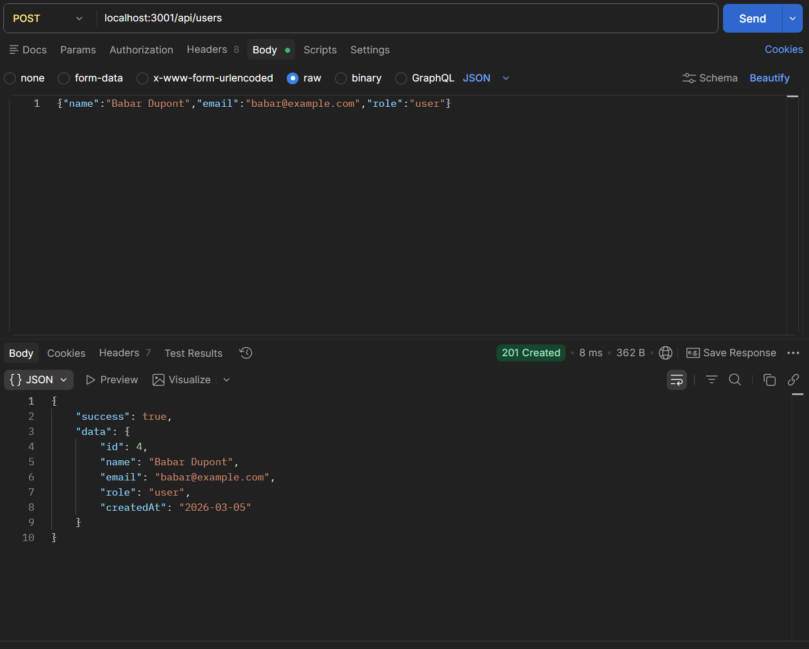
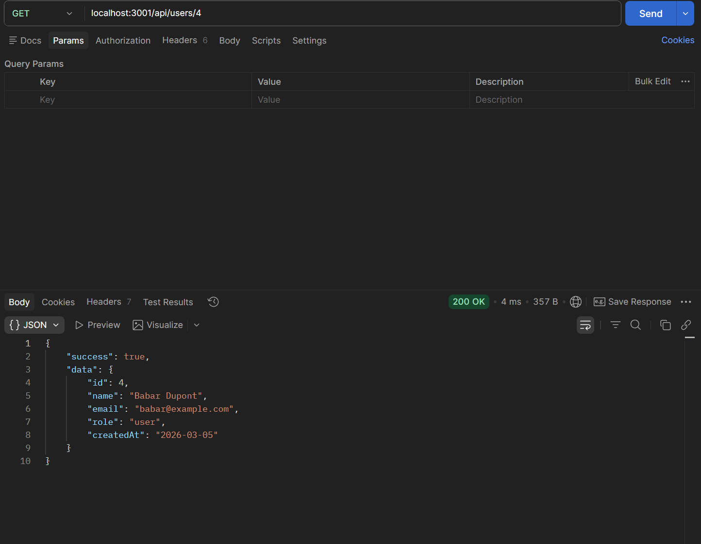
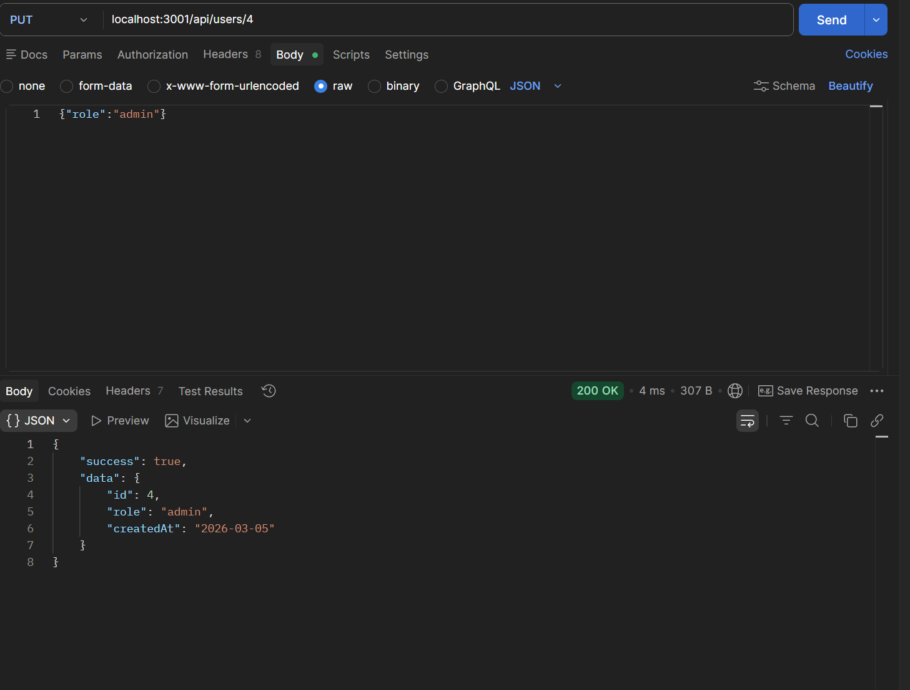
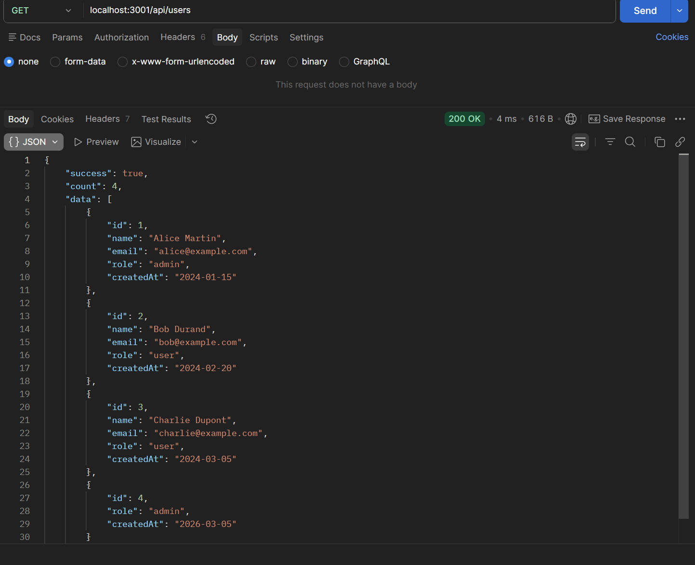
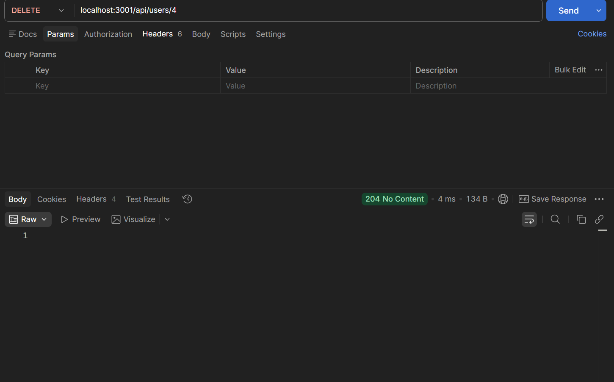
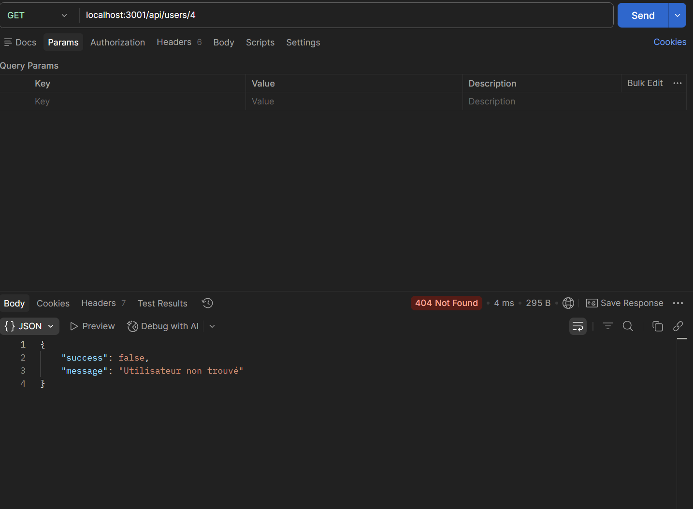

# tp2

capture d'écrans pour chacuns des scénarios demandés

1 GET /api/users → vérifiez que les 3 utilisateurs initiaux sont retournés (code 200) 

2 POST /api/users → créez un nouvel utilisateur, notez l'id retourné (code 201) 

3 GET /api/users/:id → récupérez l'utilisateur créé avec son id (code 200) 

4 PUT /api/users/:id → modifiez le rôle de cet utilisateur (code 200) 

5 GET /api/users → vérifiez que la liste contient maintenant 4 utilisateurs (code 200) 

6 DELETE /api/users/:id → supprimez l'utilisateur créé (code 204) 

7 GET /api/users/:id → tentez de récupérer l'utilisateur supprimé (code 404) 
